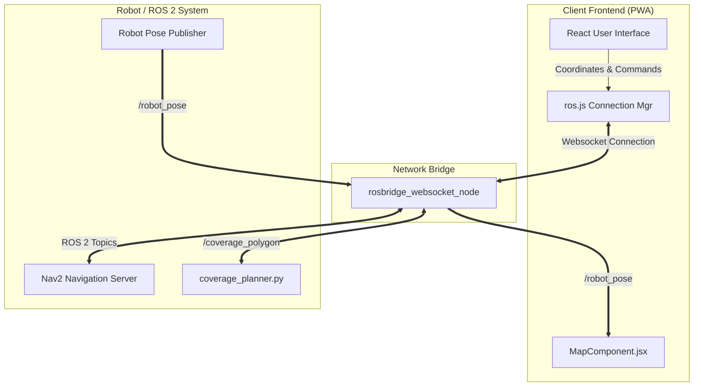

# AMR Control Dashboard: Developer & Architecture Documentation

The **AMR Control Dashboard** is a Progressive Web App (PWA) built using React, Vite, and ROSlib/ROS2D libraries. It serves as a modern, high-fidelity interface for monitoring and controlling an Autonomous Mobile Robot (AMR). It enables operators to view map layouts, monitor live robot poses, overlay costmaps, dynamically select cleaning/coverage zones by dragging on a touchscreen or mouse, and issue emergency stop or return-to-dock commands.

---

## Table of Contents
1. [Key Features](#1-key-features)
2. [System Architecture](#2-system-architecture)
3. [File Directory Structure](#3-file-directory-structure)
4. [ROS 2 Interface & Communication Protocol](#4-ros-2-interface--communication-protocol)
5. [Coordinate Transformation Mechanics](#5-coordinate-transformation-mechanics)
6. [PWA Configuration & Offline Support](#6-pwa-configuration--offline-support)
7. [Getting Started & Development Guide](#7-getting-started--development-guide)

---

## 1. Key Features

- **Progressive Web App (PWA)**: Installable directly onto mobile home screens (Android, iOS) and desktops. Works offline via service worker caching.
- **Glassmorphic Theme**: A modern dark mode design system styled with custom CSS variables (`index.css`), featuring custom gradient text headers, glowing status indicators, and responsive stats cards.
- **Live Interactive Map Canvas**:
  - Displays the 2D static occupancy grid map.
  - Dynamically overlays the live global costmap using custom transparency (alpha blending).
  - Toggles between **Static Map**, **Costmap**, or **Overlay (Both)** modes dynamically.
- **Drag-to-Draw Area Selector**:
  - Intuitive pointer-down and pointer-drag handlers to sketch a rectangular polygon zone directly on the map.
  - Converts screen-pixel coordinates to exact physical ROS coordinates in real-time.
- **Dynamic Connection & Tunneling**:
  - Connects using either local IP/hostname (automatically defaults to WebSocket port `9090`) or external tunneling/tunneling proxies (such as ngrok or localtunnel).

---

## 2. System Architecture

The control flow bridges the frontend interface (PWA) and the ROS 2 workspace running on the robot or dockerized environment:



---

## 3. File Directory Structure

The frontend application code is located in `amr_mobile_app/src`:

```bash
amr_mobile_app/
├── public/                 # Static assets (PWA icons)
├── src/
│   ├── assets/             # React asset directories
│   ├── App.css             # Boilerplate CSS template
│   ├── App.jsx             # Main container: handles connection input, layout, and control buttons
│   ├── index.css           # Styling theme, dark-mode CSS variables, and layout system
│   ├── main.jsx            # React entrypoint
│   ├── MapComponent.jsx    # Live map logic, ROS2D viewer, costmaps, and area selections
│   └── ros.js              # ROSLib WebSocket singleton connection manager
├── index.html              # HTML shell hosting canvas CDNs (EaselJS, ROS2D)
├── package.json            # Scripts and dev dependencies (React 19, Vite, VitePWA)
└── vite.config.js          # Vite configuration and PWA manifest details
```

---

## 4. ROS 2 Interface & Communication Protocol

The PWA communicates with the robot using standard JSON messages over a WebSocket connection (powered by `rosbridge_suite` on the robot side).

### Published Topics

#### 1. `/coverage_polygon`
- **Type**: `geometry_msgs/msg/PolygonStamped`
- **Description**: Triggered when the user taps "Start Coverage Area". Transmits the 4 corner points of the selected rectangle.
- **Payload Structure**:
  ```json
  {
    "header": { "frame_id": "map" },
    "polygon": {
      "points": [
        { "x": 1.25, "y": -0.82, "z": 0.0 },
        { "x": 4.50, "y": -0.82, "z": 0.0 },
        { "x": 4.50, "y": -3.15, "z": 0.0 },
        { "x": 1.25, "y": -3.15, "z": 0.0 }
      ]
    }
  }
  ```

#### 2. `/stop_and_dock`
- **Type**: `std_msgs/msg/Empty`
- **Description**: Triggered by tapping "Stop & Return to Dock". Instructs the robot to abort the current path-following task and navigate to its charging dock.

### Subscribed Topics

#### 1. `/robot_pose`
- **Type**: `geometry_msgs/msg/PoseStamped`
- **Description**: Receives the real-time position and orientation of the robot. Used to render the blue directional marker on the live map.
- **Orientation Conversion**: Converts quaternion (`x, y, z, w`) back to Yaw (theta) in radians:
  $$\theta = \text{atan2}(2.0 \cdot (w \cdot z + x \cdot y), 1.0 - 2.0 \cdot (y^2 + z^2))$$

#### 2. `/map`
- **Type**: `nav_msgs/msg/OccupancyGrid`
- **Description**: Handled internally by `ROS2D.OccupancyGridClient` to display the static layout map.

#### 3. `/global_costmap/costmap`
- **Type**: `nav_msgs/msg/OccupancyGrid`
- **Description**: Rendered as a semi-transparent overlay to visualize inflated obstacle buffers, letting operators understand path restrictions.

---

## 5. Coordinate Transformation Mechanics

A key system feature is mapping click/drag positions on the device's screen canvas to exact coordinates in the physical ROS 2 coordinate system.

```
[Screen Touch Event] ===> [Canvas Pixel Space] ===> [ROS 2 Map Space (meters)]
  (clientX, clientY)         (internalX, internalY)          (rosX, rosY)
```

### Conversion Logic in `MapComponent.jsx`
When an operator interacts with the map canvas, the coordinates are computed as follows:

1. **Calculate Client-to-Canvas Scale Factors**:
   Account for scaling changes when the canvas element is resized to fit mobile screens.
   $$\text{scaleX} = \frac{\text{canvas.width}}{\text{rect.width}}$$
   $$\text{scaleY} = \frac{\text{canvas.height}}{\text{rect.height}}$$

2. **Compute Internal Canvas Pixels**:
   $$\text{internalX} = (clientX - rect.left) \cdot \text{scaleX}$$
   $$\text{internalY} = (clientY - rect.top) \cdot \text{scaleY}$$

3. **Map Pixels to ROS Coordinates (in Meters)**:
   Using the current occupancy grid's origin pose, height, and width:
   $$\text{rosX} = \text{grid.pose.position.x} + \left( \frac{\text{internalX}}{\text{canvas.width}} \cdot \text{grid.width} \right)$$
   $$\text{rosY} = \text{grid.pose.position.y} + \left( \left(1.0 - \frac{\text{internalY}}{\text{canvas.height}}\right) \cdot \text{grid.height} \right)$$

> [!NOTE]
> The Y-axis transformation inverts the coordinates ($1.0 - \text{fraction}$) because the screen coordinate system's origin $(0,0)$ lies in the top-left corner, whereas the ROS coordinate system's origin lies in the bottom-left corner.

---

## 6. PWA Configuration & Offline Support

The application is bundled using **Vite** and configured via `vite-plugin-pwa` for PWA functionality.

### Manifest Configuration (`vite.config.js`)
- **Display Mode**: `standalone` (removes mobile browser address bars to simulate a native app look and feel).
- **Theme Color**: `#0f172a` (ensures OS UI elements match the app's dark header/status bar background).
- **Register Type**: `autoUpdate` (caches assets automatically and updates service workers immediately when new builds are detected).
- **Icons**: Serves high-resolution `192x192` and `512x512` launcher icons.

---

## 7. Getting Started & Development Guide

### 1. Installation
Navigate into the `amr_mobile_app` folder and install dependencies:
```bash
cd amr_mobile_app
npm install
```

### 2. Start Local Development Server
Run the local Vite server:
```bash
npm run dev
```
The console will output the local network URL (e.g., `http://localhost:5173` or `http://192.168.1.X:5173`). Open this URL in any mobile device on the same local network.

### 3. Build & Test PWA Locally
Build static files and test service worker behavior locally:
```bash
npm run build
npm run preview
```

### 4. Connection Workflow
1. Start `rosbridge_server` on your robot:
   ```bash
   ros2 launch rosbridge_server rosbridge_websocket_launch.xml
   ```
2. Open the PWA dashboard in your browser.
3. Enter the robot's IP address (or external tunnel URL) and click **Connect**.
4. Once connected, the map and battery/status cards will refresh dynamically.
5. Tap and drag on the map grid to select your zone, then tap **Start Coverage Area** to run the path planner.
